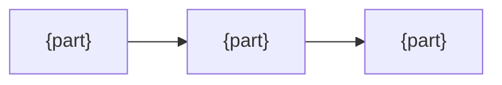

<!--
Rules (hidden; no need to delete)

- The reader is a maintainer. This alone lets them judge whether a change still fits the purpose.
- Never repeat what the README or the code already says. Usage lives in the README, mechanics in the code, history in git.
- Number the principles (P1, P2, ...) and point to them from each decision's Why.
- Every decision has exactly three lines: Decision / Why / Trade-off. A decision without a reason is not written.
- Trade-off reads "what was given up -> how it is compensated". Write "none" when nothing was given up.
- Order decisions from the largest (closest to the purpose) to the smallest.
- Headings are English words. One decision = one heading.
- Show with tables and diagrams. Never more than three lines of prose in a row. Draw a diagram only when four or more parts interact; otherwise a table is enough.
- Unverified facts go under Assumptions, marked "unverified". Never present a guess as a fact.
- Minimal references. Do not point to sections of other documents; state the point here in one line.
- Do not be exhaustive. Keep only the decisions a maintainer might otherwise undo.
- About 150 lines. Cut when longer.
-->

# {Name} design

## Purpose

{One line: what problem it solves, and what goes wrong without it}

## Assumptions

- {What is taken as true}
- Unverified: {what has not been checked, and what changes if it is wrong}

## Principles

- P1: {a rule for judging decisions}
- P2: {a rule for judging decisions}
- P3: {a rule for judging decisions}

## Structure

| Part | Responsibility |
|---|---|
| {part} | {what it does, and what it does not} |

## Decisions

### {Decision name}

- Decision: {what was decided}
- Why: {P1} {one line}
- Trade-off: {what was given up} -> {how it is compensated}

### {Decision name}

- Decision:
- Why:
- Trade-off:

## Conventions

{Rules the user must learn that the platform cannot express. Delete this section when there are none}

| Convention | Why the standard way cannot express it |
|---|---|
| {convention} | {reason} |

## Out of scope

- {What this does not cover}
