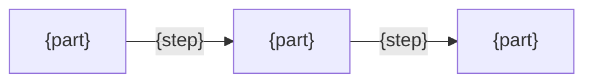

# {Name} design

## Goals

<!-- "What problem does this solve, and how do we know it is solved?" One goal per promise in the README's "Who it is for": the problem behind it, and the condition that counts as achieved. A developer uses this to judge whether a change still serves the purpose. -->
- {the problem behind one promise} → {what counts as achieved}

## Non-goals

<!-- "What does it deliberately not do?" So nobody adds it later by accident. -->
- {what it does not do}

## Solution

<!-- "What is the core idea, and why does it work?" A few bullets. Facts relied on but not verified go on the "Assumes" bullet, so they are re-checked when something breaks. -->
- {the core idea}
- {why it solves the problem}
- Assumes: {unverified facts, or none}

## Structure

<!-- "Who are the parts, who depends on whom, and how does work move?" One flowchart of the parts and the main path through them, then one bullet per part saying what it must and must not do. Only what the code does not show. -->

- {part}: {what it does, and what it must not do}

## Alternatives

<!-- "Why not the other way?" Each option someone would reasonably propose, and what it would cost or break. This stops the same debate from recurring. -->
- {option}: {what it would cost or break}
