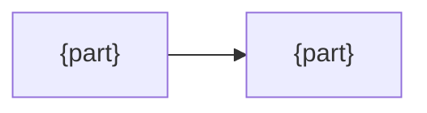

<!--
Rules

1. A maintainer judges a change with this alone. Never repeat the README or the code.
2. Record a decision only when someone could reasonably have decided otherwise.
   Three lines: Decision / Why / Trade-off. No reason, no entry.
3. Why points to a principle (P1, P2, ...). No principle, no decision.
4. A fact you have not checked goes under Assumptions, marked unverified.
5. Shorter wins. Delete a section whose content is obvious or lives elsewhere.
-->

# {Name} design

## Purpose

{One line: the problem it solves, and what goes wrong without it}

## Non-goals

- {What it deliberately does not do}

## Assumptions

- {Taken as true}
- Unverified: {not checked; what changes if wrong}

## Principles

- P1: {a rule that decides between two reasonable options}
- P2: {…}

## Decisions

### {Decision name}

- Decision: {what was chosen}
- Why: {P1} {one line}
- Trade-off: {what was given up} -> {how it is compensated, or "none"}

## Conventions

{Only if users must learn rules the platform cannot express. Otherwise delete}

| Convention | Why the standard way cannot express it |
|---|---|
| {convention} | {reason} |

## Structure

{Only when four or more parts interact and the code does not show it. Otherwise delete}

