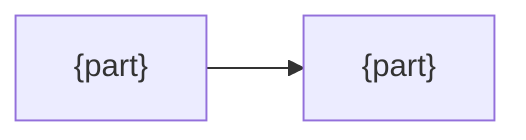
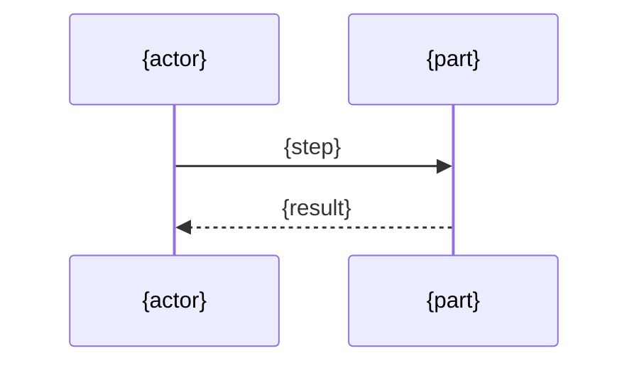

# {Name} design

## Goals

<!-- "What problem does this solve?" What goes wrong without it. A developer uses this to judge whether a change still serves the purpose. -->
- {the problem, and what goes wrong without this}

## Non-goals

<!-- "What does it deliberately not do?" So nobody adds it later by accident. -->
- {what it does not do}

## Solution

<!-- "What is the core idea, and why does it work?" A few lines. Facts relied on but not verified go on the "Assumes:" line, so they are re-checked when something breaks. -->
{The core idea, and why it solves the problem}

Assumes: {unverified facts, or none}

## Structure

<!-- "Who are the parts, and who depends on whom?" A diagram of the parts and a table of what each must and must not do. Only what the code does not show. -->

| Part | Responsibility |
|---|---|
| {part} | {what it does, and what it must not do} |

## Flow

<!-- "How does work move through the parts?" One diagram of the main path. Only where the order matters and the code does not show it. -->

## Alternatives

<!-- "Why not the other way?" Each option someone would reasonably propose, and what it would cost or break. This stops the same debate from recurring. -->
| Alternative | Why not |
|---|---|
| {option} | {what it would cost or break} |
