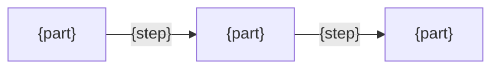

# {Name} design

<!--
Purpose: a developer changing this can tell whether the change still fits.
How: write only what the README and the code do not say.
-->

## Goals

<!--
Purpose: a change that breaks a promise in the README is caught here.
How: write one line per user story in the README: the problem behind that promise, then the condition that counts as solved.
-->
- {the problem behind one promise} → {what counts as solved}

## Non-goals

<!--
Purpose: what was left out on purpose stays out, instead of being added as if forgotten.
How: write each thing deliberately not done. Every "If …, then …" in the README's Usage has its reason here or in Solution.
-->
- {what it does not do}

## Solution

<!--
Purpose: a developer keeps the choices that make the goals hold, even when the code alone would not tell them why.
How: write each choice that shapes the whole as what is done and why it serves a goal. Put a fact the solution relies on but nobody has verified on the "Assumes" line.
-->
- {what is done}: {why it serves the goal}
- Assumes: {unverified facts the solution relies on, or none}

## Structure

<!--
Purpose: a developer sees where a responsibility lives before moving it.
How: draw one flowchart. Nodes are the parts; arrows are the steps of the main Usage scenario, named the same way. Then write one bullet per part: what it owns and what it must never do.
-->

- {part}: {what it owns, and what it must never do}
