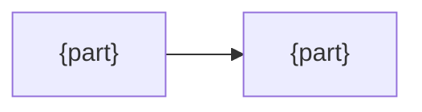

<!-- For the maintainer. Each section answers one question they have when changing this. Delete any line the README or the code already answers. -->

# {Name} design

## Why

- Goal: {the problem, and what goes wrong without this}
- Not: {what it deliberately does not do}
- Unverified: {facts assumed but not checked}

## Principles

- P1: {the rule that decides between two reasonable options}
- P2: {…}

## Decisions

| Decision | Why | Cost |
|---|---|---|
| {what was chosen} | {P1, one line} | {what was given up, or none} |

## Conventions

| Rule users must learn | Why the standard way cannot express it |
|---|---|
| {rule} | {reason} |

## Structure

{Only when the code does not show it}

