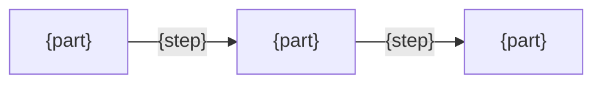

# {Name} design

<!--
Purpose: a developer understands why it is built this way, and changes it without breaking what matters.
How: write what the README and the code do not say.
-->

## Goals

<!--
Purpose: the developer knows what this must achieve, and judges any change by it.
How: write what must be true for the user, one line per promise in the README.
-->
- {what must be true for the user}

## Non-goals

<!--
Purpose: the developer knows where the boundary is, and does not build past it.
How: write what is left out, with the reason in a few words.
-->
- {what is left out}: {why}

## Approach

<!--
Purpose: the developer understands the approach, and makes changes that fit it instead of fighting it.
How: write the approach as the few choices that shape the whole, each with the reason it serves a goal. Name a fact the approach relies on but nobody has verified as an assumption.
-->
- {what is done}: {why it serves the goal}
- Assumes: {unverified facts, or none}

## Structure

<!--
Purpose: the developer knows where each thing lives, and changes it in the right place.
How: draw one flowchart of the parts and the main path through them, with the arrows named as the user sees the steps. Then write one bullet per part: what it owns.
-->

- {part}: {what it owns}
