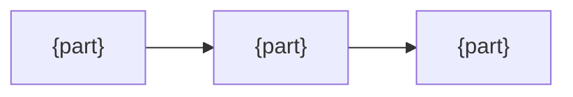
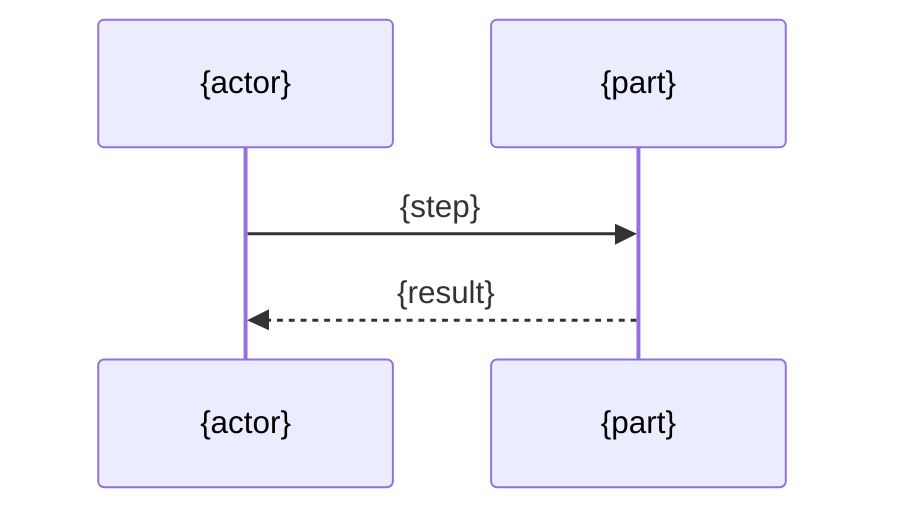

<!--
1. For the maintainer: why it is this way, never how to use it or how the code works.
2. A decision is recorded only if someone could reasonably have chosen otherwise.
3. Diagram over prose. Unchecked facts say "unverified".
-->

# {Name} design

## Why

{The problem, and what goes wrong without this. One line}
{Not: what it deliberately does not do. One line}

## Structure

## Flow

## Decisions

| Decision | Why | Cost |
|---|---|---|
| {what was chosen} | {the reason, one line} | {what was given up, or none} |

## Conventions

{Only if users must learn rules the platform cannot express. Otherwise delete}

| Rule | Why the standard way cannot express it |
|---|---|
| {rule} | {reason} |
