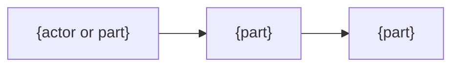
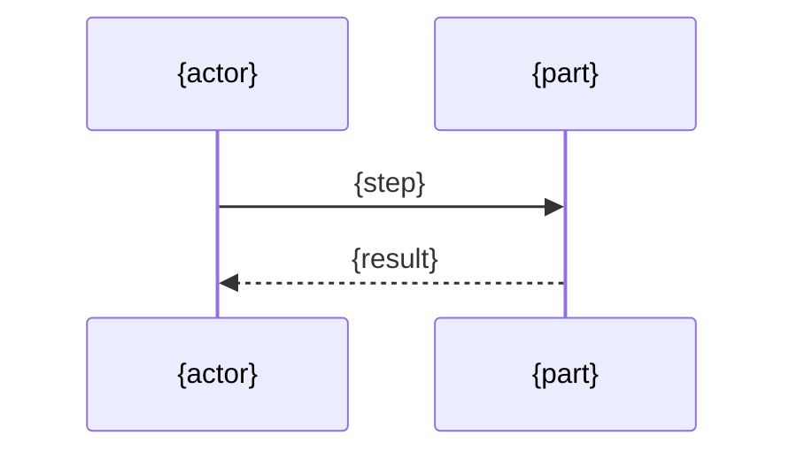

<!--
Rules

- For developers. Answer why it is this way.
- Never repeat what the README or the code already says.
- No history, no changelog. Only the current design.
- Diagrams and tables over prose. Never more than three lines of prose in a row.
- Headings are plain English words.
- Refined, not exhaustive. Keep only what a developer would otherwise get wrong.
- Few references. State the point here in one line instead of pointing elsewhere.
- Unverified facts say so.
-->

# {Name} design

## Goals

- {the problem, and what goes wrong without this}

## Non-goals

- {what it deliberately does not do}

## Solution

{The core idea, in a few lines. Why it solves the problem}

Assumes: {facts relied on but not verified, or none}

## Structure

| Part | Responsibility |
|---|---|
| {part} | {what it does, and what it must not do} |

## Flow

## Alternatives

| Alternative | Why not |
|---|---|
| {option considered} | {what it would cost or break} |
