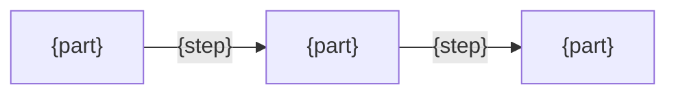

# {Name} design

<!--
For the developer changing this. Every section exists so they can tell whether a change still fits. Anything the README or the code already says does not belong here.
-->

## Goals

<!--
Answers: "What problem does this solve, and how do we know it is solved?"
Write: one line per user story in the README's "Who it is for": the problem behind that promise, then the condition that counts as solved. A change that breaks a condition here breaks a promise there.
Do not write: features, or goals no story asks for.
-->
- {the problem behind one promise} → {what counts as solved}

## Non-goals

<!--
Answers: "What does it deliberately not do?"
Write: what was left out on purpose, so nobody adds it later thinking it was forgotten. Each "If …, then …" in the README's Usage has its reason here or in Solution.
Do not write: things that are simply not built yet.
-->
- {what it does not do}

## Solution

<!--
Answers: "How does it solve the problem, and why does that work?"
Write: the choices that shape the whole, each as what is done and why it serves a goal. Keep the ones a developer could reasonably undo without knowing the reason. A fact the solution relies on but nobody has verified goes on the "Assumes" line.
Do not write: options that were rejected, history, or how the code implements it.
-->
- {what is done}: {why it serves the goal}
- Assumes: {unverified facts the solution relies on, or none}

## Structure

<!--
Answers: "What are the parts, what does each own, and how does work move between them?"
Write: one flowchart, always. Its nodes are the parts, its arrows are the steps of the main Usage scenario, named the same way. Then one bullet per part: what it owns, and what it must never do.
Do not write: anything the code shows on its own, such as file names or function lists.
-->

- {part}: {what it owns, and what it must never do}
