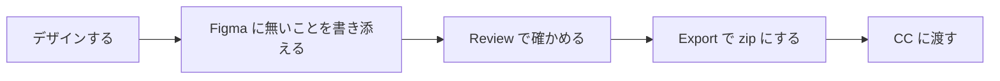

# Telldes

Figma でデザインした LP / HP を、Claude Code（以下 CC）がカンプと同じ見た目に組めるかたちで渡せる Figma プラグイン。

## 何が変わるか

カンプの画像だけを CC に渡すと、CC は色・大きさ・間隔の値や、どこが伸びてどこが固定か、動きやリンク先を画像から推し量る。推し量りは外れ、外れはページができてから見つかり、デザイナーは言葉で説明し直すことになる。

Telldes は、Figma のファイルにある値をそのまま渡し、ファイルに無いこと（動き・リンク先・どの幅で切り替えるかなど）は渡す前にデザイナーから受ける。このままでは正しく伝わらないところは、渡す前に Figma の中で知らせる。デザイナーは説明し直さずに済み、CC は推し量らずに組める。

## 使う流れ



- デザインする: いつもどおり Figma の Auto Layout・変数・スタイル・コンポーネントで作る。推奨するトークン（色・余白・文字など）の一式は Setup を押せばそろう。Telldes のために覚える決まりは、Figma の仕組みで表せないことだけ
- 書き添える: 動き・ホバー・リンク先・意図は、レイヤーごとの note に文章で書く。どの幅から切り替えるか、ダーク対応するかなど、CC が値として使うことは決まった欄に入れる
- Review で確かめる: 渡すと壊れるもの（error）は直すまで Export させず、つなぎ忘れのような見落としは知らせる。知らせは、そのトークン・フレーム・レイヤーのところに出る。渡らないものも、ここで分かる
- Export で zip にする: CC への指示、トークン、フレームごとの記述と画像、渡せなかったものの一覧が1つの zip になる。ダーク対応するなら Light と Dark の両方が入る
- CC に渡す: zip を置いて頼む。CC は中の指示どおりにページを組み、実装の判断（フォントの読み込み方など）はその場で使う人に確かめる

作り方の手順は [ガイド](docs/guide.md) にある。

## 前提

- Figma の無償版で動き、有料の機能に頼らない
- 1人のデザイナーが作る LP / HP 向け。渡すフレームを置く Figma のページと、部品置き場や下書きのページを分けて作る
- Telldes がするのは CC に渡すかたちを作るところまでで、コードは CC が作る

なぜこの形なのかは [設計書](docs/design.md) にある。

## はじめる

今は開発版として読み込む。

1. bun（JavaScript の実行環境）を https://bun.sh から入れる
2. リポジトリを取り、ビルドする

   ```
   git clone https://github.com/lovaizu/telldes.git
   cd telldes
   bun install && bun run build
   ```

3. Figma デスクトップアプリでファイルを開き、Plugins → Development → Import plugin from manifest… で、このリポジトリの `manifest.json` を選ぶ
4. Plugins → Development → Telldes で開く。ここから先は [ガイド](docs/guide.md) へ

## 開発

```
bun run build       # 型検査とビルド（dist/ui.html と dist/code.js）
bun run typecheck   # 型検査だけ
```

## License

MIT
