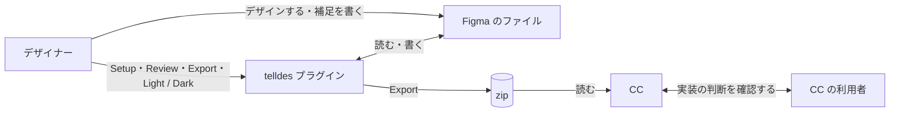
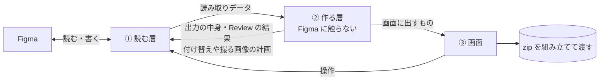

# Telldes 設計書

telldes を作る人・直す人のための文書。デザイナーの作り方とプラグインの使い方は README にある。

## 1. 目的

Figma で LP / HP をデザインし、Claude Code（CC）にコーディングさせる。デザイナーが作り方のガイドに従ってデザインするだけで、CC がデザインカンプと同じ見た目のコードを書ける状態を目指す。

CC にカンプの画像だけを渡すと、背景と中身の区別、色・大きさ・間隔の値、見出しのレベル、どこが伸びてどこが固定か、動きを、CC が画像から推測することになる。推測は外れ、手戻りになる。

出力の正確さを何より優先する。出力が不正確なら、CC のコードもそのまま不正確になる。

## 2. 前提と制約

- デザイナーは1人。作るのは LP / HP
- Figma は無償版（Starter）で使う。有料の機能には頼らない
- デザイナーに新しい作法を覚えさせない。作り方は Figma 公式のベストプラクティスをそのまま土台にし、telldes 独自の約束は、公式のやり方では表せないことだけに限る。独自の約束は増えるほど守られない

## 3. 考え方

Figma のベストプラクティスに沿って作れば、ファイルはデザインシステムに近い形になる。Auto Layout で並べ、色や余白は変数、文字はスタイル、繰り返す部品はコンポーネントにする形だ。この形には、コードに要る情報 — 構造、大きさの決め方、色や余白の役割 — がそろっている。それを書き出せば、CC は画像から推測せず、決まった規則で再現できる。

そこで telldes は、ガイドと、それに沿った変数とスタイルの一式を作る Setup と、ガイドからのずれを見つける Review を用意し、ファイルにある情報を CC がそのまま使える形で書き出す（Export）。Figma のデータに無い情報（動き、どの幅で切り替えるか、ページの題名など）は、プラグインで補足として受けて一緒に渡す。それでも無いものは、推測せずに「無い」と書いて渡す。

## 4. 全体像

### 4.1 登場人物と役割



- デザイナー: ガイドに従って Figma でデザインする。Figma のデータに無いことを補足として書く。Review の error を直して Export する
- Figma のファイル: デザインそのもの。レイヤーの木、変数、スタイル、補足（note）と Export 設定を持つ
- telldes プラグイン: ファイルを読み、Review し、zip を Export する。変数とスタイルの一式を作る（Setup）。テーマを Light と Dark で切り替える
- zip: CC への依頼書。CC はこれだけで作業できる
- CC: zip を読んでコードを書く。デザインでなく実装の判断（フォントの読み込み方、置き場所など）は、zip の中の `steering.md` に沿って利用者に確認する

デザインの判断はプラグインが Figma の上でデザイナーから受け、実装の判断は CC が利用者から受ける。分ける基準は「誰が答えられるか」。デザイナーは Figma を開いている今が一番答えやすく、zip を受け取る人がデザイナーとは限らない。

### 4.2 プラグインの構成

Figma のプラグインは2つの部分に分かれ、メッセージでやり取りする。Figma を操作できるが画面を持たない部分と、画面だけを持ち Figma に触れない部分（iframe）である。

この上で、コードを3つの層に分ける。



- ① 読む層: Figma から読み、JSON にできる「読み取りデータ」にまとめる。②が作った計画どおりに Figma へ書き込み、画像を書き出す。自分では判断しない
- ② 作る層: 読み取りデータだけから、zip に入るファイルの中身、Review の結果、撮る画像の一覧、テーマの付け替えの計画、Setup の計画を作る。Figma に触らない
- ③ 画面: ②の結果を見せ、操作を①に渡す。zip を組み立ててダウンロードさせる

判断をすべて②に集めるのは、②だけが Figma なしで動かせ、テストで確かめられるから。①は実機でしか確かめられないので、判断を持たせず薄くする。①は Figma を操作できる部分に、③は iframe に置く。②は Figma に触らないので、どちらに置いても同じ結果になる。

### 4.3 データの流れ

Export は次の順に進む。

1. Light にする
2. ①がページ全体と、ファイルの変数・スタイル・設定を読む
3. ②が Review する。error があればここで止める
4. ②が zip のファイルの中身と、撮る画像の一覧を作る
5. ①が画像を撮る
6. ダーク対応なら、Dark に付け替えてもう一度撮り、Light に戻す
7. ③が zip にまとめる

Review と出力は、2 で読んだ同じデータから作る。別々に読むと、Review したものと渡したものがずれうるから。途中で失敗しても、必ず Light に戻す。

### 4.4 zip の中身

```
telldes-export/
├── prompt.md          CC への作業指示。最初に読む
├── steering.md        実装の判断の確認項目とタスク
├── tokens.json        変数とスタイルを CSS 変数にしたもの
├── settings.json      Export 設定（切り替える幅、ダーク対応、ページの題名など）
├── README.md          中身の説明と、含まれなかったもの
├── site/              favicon と OG 画像
└── {画面}/            ページ直下のフレームごと
    ├── spec.json      レイヤーの木と、各レイヤーの値
    ├── screenshots/   セクションとブロックの画像（ダーク用は screenshots-dark/）
    └── assets/        画像とアイコン（ダーク用は assets-dark/）
```

各ファイルの形と読み方は `prompt.md` にある。形を決めるときの約束は次の4つ。

- 形が揃っている: 同じ種類のものは同じ形で出る
- 1か所にだけある: 同じ事実を2か所に書かない
- 欠けていると分かる: 落としたものは、落としたと書く
- 推測させない: 指定されていないことは出さない。値から意図を推測しない

## 5. 仕組み

### 5.1 Review

Review の結果は3種類ある。

- error: 直さないと出力が壊れるもの。Export を止める
- 付け忘れの知らせ: 出力は壊れないが、指定し忘れたと機械的に分かるもの（トークンと同じ値なのにつないでいない、など）。止めない
- 含まれなかったもの: telldes が扱わないもの。画面と zip の README に載せる

error にするのは、デザイナーが選んだやり方との食い違いだけ。たとえば「変数を使え」は error にしない。ダーク対応を ON にしたファイルでだけ、変数につないでいない色を error にする。同じ原因の違反は1行にまとめる（同じ色が30か所なら1行）。

### 5.2 ダークモード

変数を Light・Dark・Base（テーマで変わらないもの）の3つのコレクションに分け、ページ全体の変数のつながりを Light と Dark の間で付け替える。無償版では1つのコレクションに複数のモードを作れないが、コレクションの数には制限が無い。

ダーク用のフレームを複製しない。複製すると、同じページが別ページとして CC に渡り、Light の変更が Dark に伝わらない。代わりに、ファイルが「今どちらのテーマか」という状態を持つ。Export の途中で失敗しても必ず Light に戻し、それでも Dark で残った場合は、次に開いたときに戻すよう促す。

### 5.3 Setup

作り方のガイドどおりの変数とスタイルの一式を、ファイルに作る。無償版ではファイルをまたいで変数を共有できず、手で作らせると、使える欄の絞り込みや CSS 変数名の設定を漏らすため。何度押しても増えないように、あるべき一式と今あるものの差だけを作る。Setup を使わずに作ったファイルも、そのまま読めて正しく出る。

### 5.4 テスト

テストは、zip に入るものの形・Review の規則・付け替えの計算が約束どおりかだけを確かめる。

- ②に読み取りデータを与え、結果を正解と丸ごと比べる。一部だけを見るテストは、見ていないところが崩れても通る
- 読み取りデータは、実物の見本ファイルから①で取る。手で作った入力は、Figma が実際に返す形と食い違いうる
- 正解は今の出力を写して作らない。`prompt.md` と、見本にわざと入れたものの一覧に照らして作る
- Figma でしかわからないこと（①が読んだ値、画像の書き出し、付け替えの書き込み、画面）は、テストで真似ずに実機で確かめる

## 6. 捨てた案と代償

捨てた案:

- telldes が値から意図を推測する（大きな余白をコンテンツ幅とみなす、など）: 推測は外れうる。外れても誰も気づかない
- ダーク用のフレームを複製する: 5.2 のとおり
- 機能ごとのタブで画面を組む: 同じレイヤーの違反と補足が別々のタブに入り、直す場所と知らせる場所がずれた。画面はトークン・画面・レイヤーという、デザイナーが気にするものごとに組む
- 手で作った入力でテストする: 5.4 のとおり

代償:

- ファイルがテーマの状態を持ち、中断で Dark のまま残りうる
- キャンバスで Light と Dark を並べて比べられない。比べるのは Export した画像で行う
- 画面でないもの（部品置き場など）を別のページに置くため、ページ数に上限の無い Drafts で作る前提になる。共同編集はできない
- CSS で同じに描けないもの（特殊なグラデーション、破線など）は Figma に描かせた画像で渡す。それでも描けないものは、描かずに「含まれなかったもの」として伝える。近い見た目を CC に作らせることはしない
