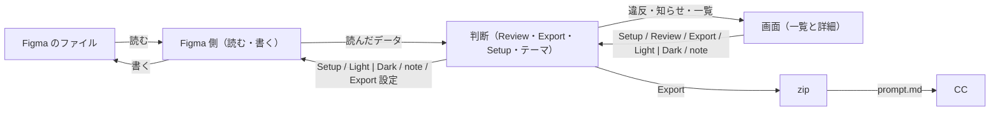

# Telldes design

## Goals

- Figma のデザインが、Claude Code（以下 CC）がカンプと同じ見た目に組めるかたちで渡る。渡した zip から CC が作ったページのスクリーンショットが、Export の画像と色・大きさ・間隔・文字・並びで一致する（Dark support ON なら Light と Dark の両方）
- 渡す前に、直さないと出力が壊れるものと、渡らないものが分かる。zip を開かず、CC が作ってからでもなく、プラグインの画面で分かる

## Non-goals

- 値から意図を推測しない: 推測は外れても誰も気づかない
- 近い見た目を CC に作らせない: 出力が不正確なら CC のコードもそのまま不正確になる
- 有料の機能に頼らない: デザイナーは Figma の無償版で使う
- チームのプロジェクト向けに作らない: 渡さないものは別の Figma のページに置くので、ページ数に上限の無い Drafts が前提
- 「変数を使え」と促さない: 使わなくても値はそのまま出て、正しさは変わらない
- Auto Layout・レイヤー名を強制しない: ファイルにあるまま渡せば出力は壊れない。デザイナーに新しい作法を覚えさせない
- キャンバスで Light と Dark を並べて比べられるようにしない: 変数の付け替えでダークを表す代償。比べるのは Export した画像で行う

## Approach

- ファイルにある事実を書き出し、推測しない: ベストプラクティスどおりのファイル（Auto Layout、変数、スタイル、コンポーネント）にはコードに要る情報がそろっている。Figma のデータに無いことはデザイナーから受け、それでも無いものは「無い」と書く。CSS で同じに描けないもの（特殊なグラデーション、破線など）は Figma に描かせた画像で渡す
- 出力の形は、同じ種類は同じ形、同じ事実は1か所、落としたものは落としたと書く、指定されていないことは出さない: 形が揃えば CC の読み間違いが減り、書いていないことを CC が補わずに済む
- Web ページの組は Figma の Section で表す: 幅違いのフレームが同じ Web ページだという情報は Figma のデータに無い。Section は公式の仕組みなので、Telldes だけの操作を覚えさせずに済み、組がキャンバスに見える。フレーム名から推し量ると打ち間違いに気づけず、プラグインの設定で選ばせると組がファイルに見えない。読み方は「Section 直下のフレームだけ」の1文にして約束を最小にする。代償として、渡すフレームを置く Figma のページでは Section をキャンバスの整理には使えない
- 一番狭いフレームは From width を空にする: どこから使われるかは決めることが無く、どれが一番狭いかはフレームの幅（描かれた事実）から分かる。ほかのフレームの From width（どの幅からそのフレームを使うか）と Content width（コンテンツ幅）はデザイナーが宣言する。1440px のフレームの左右の余白がただの余白かコンテンツ幅を作るものかは、データからは決められない
- デザインの判断はデザイナーに、実装の判断は CC の利用者に聞く: デザイナーは Figma を開いている今が一番答えやすく、zip を受け取る人がデザイナーとは限らない。Telldes は LLM を持たず質問をその場で作れないので、決めることを前もって洗い出し、Export 設定の欄にする。CC が値として使うもの（From width、Content width、Dark support、Page title）は決まった値の欄で受け、文章で受けるものは、すべての Web ページに効くことを Rules for every page に、レイヤーごとのことを note に分ける。自由に書かせると書き方がぶれて機械的に読めない
- 判断は Figma に触らない部分に集め、Review と Export は一度読んだ同じデータから作る: Figma なしで動かせ、テストで確かめられるのはこの部分だけ。別々に読むと Review したものと渡したものがずれる。Review が見る範囲も Export が書き出す範囲と同じにし、渡さないものを直さないと渡せない状態を作らない
- Review は出力が壊れるときだけ止める: error は、渡しても CC が正しく作れないものだけ。Dark に付け替わらない色（Dark support ON で変数につないでいない色。Dark コレクション自体が無いときも同じ）と、Web ページ名の重複（zip のフォルダがぶつかる）。Auto Layout 未適用・デフォルト名・同名は error にしない。同名を許す代わり、画像・アセットのファイル名はレイヤーの id で区別する。指定し忘れと機械的に分かるものは止めずに知らせ、同じ原因は1行にまとめる。ライトだけのファイルでどのトークンとも違う値は報告しない。並べると LP 1枚で数十〜数百行になり、本当に落としたものが埋もれる
- ダークはフレームを複製せず、変数を付け替える: 無償版では1つのコレクションに複数のモードを作れないので、Light・Dark・Base の3コレクションに分け、Dark には Light と同じ名前の変数を置き、Figma のページ全体のつながりを付け替える。複製すると同じ Web ページが別の Web ページとして渡り、Light の変更が Dark に伝わらない。代償として、ファイルが「今どちらのテーマか」という状態を持つ。Export 後は失敗しても Light に戻し、Dark のまま残ったファイルを開いたら戻すよう促す
- トークンにするのは CSS の値になるものだけ: Color・Number と書体につないだ String、Text Style、Effect Style。文字の中身につないだ String と Boolean は値であって CSS の変数にならない。Color Style を出さないのは、色を変数と Color Style の2つで持つと同じ事実が2か所になり、Light / Dark の付け替えは変数でしかできないから
- Setup は足りないものだけ作る: 無償版ではファイルをまたいで変数を共有できず、手で作らせると使える場所の絞り込み（Scope）や CSS の変数名（Code syntax）を漏らす。差だけを作れば何度押しても増えず、手で作ったものを上書きしない。Setup を使わないファイルもそのまま読めて正しく出る
- 画面はオブジェクト指向で組む: 並べるのはデザイナーが気にするもの（トークン・Web ページ・フレーム・レイヤー）であり、機能ではない。違反・知らせ・note は持ち主の行に出し、持ち主はデザイナーが下す1つの判断の対象で決める（同じ色が30か所なら判断は「この色をどうするか」の1つで、トークンの1行）。Export 設定も持ち主に付け、1つの事実を1か所に置く。上部に置くのはファイル全体の状態と操作（Light | Dark、Review と件数、Export）だけ。Setup はトークンを作るのでトークンの一覧に置き、足りないときはタブに印を出す。使っている所を押しても画面は持ち主の詳細のまま動かず、30か所を順に直すあいだ判断の対象を見失わない。画面の言葉は英語。Community で配るプラグインは利用者の言語が分からない
- 渡さないものは別の Figma のページに置いてもらう: どのフレームを渡すかを示す印は Figma に無いので、ページ直下と Section 直下の表示中のフレームをすべて渡す
- テストは実物から取った入力で、正解は約束に照らして作る: 手で作った入力は Figma が実際に返す形と食い違いうる。正解を今の出力から写すと、崩れていても通る。結果は丸ごと比べる。一部だけ見るテストは、見ていないところが崩れても通る。Figma でしか分からないこと（読み取った値、画像の書き出し、付け替えの書き込み、画面）は実機で確かめる
- Assumes: 無償版でコレクションの数に制限が無い。Section 直下のフレームを API で読める。ページ全体の変数のつながりを付け替えられる。Figma の注釈が無償版で使えるか（使えても note はプラグインで受ける。プランに依らないため）

## Structure

- Figma のファイル: デザインと変数・スタイル、Export 設定と note、今のテーマ。すべてファイルに保存される
- Figma 側（読む・書く）: 読んだものを JSON にできるデータにまとめ、言われたとおりに書き込む。判断を持たない
- 判断（Review・Export・Setup・テーマ）: 何を渡すか、何がトークンか、違反・知らせ、zip の中身、Setup が作る差、付け替える先。読んだデータだけを受け、Figma の API を呼ばない。テストの対象はここだけ
- 画面（一覧と詳細）: 表示と操作だけ。Figma を直接呼ぶのはレイヤーの選択だけで、ファイルは変えない
- zip: `prompt.md`、`tokens.json`、`README.md`、Web ページごとのフォルダ
- CC: `prompt.md` のとおりにページを作る。実装の判断は利用者に聞く
