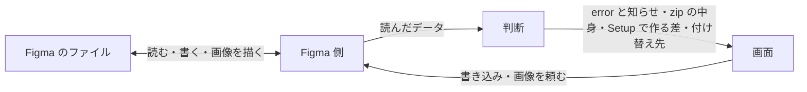

# Telldes 設計書

## 目的

Figma で作った LP / HP のデザインを、Claude Code（以下 CC）がカンプと同じ見た目のコードにできるかたちで渡す。カンプの画像だけでは、背景と中身の区別、色・大きさ・間隔の値、見出しのレベル、どこが伸びてどこが固定か、動きを CC が推し量り、外れる。

何より優先するのは出力の正確さ。出力が不正確なら CC のコードもそのまま不正確になり、しかもページができるまで誰も気づかない。だから、正しく伝わらないものは渡す前にデザイナーに見せる。

## 前提

- Figma の無償版で使う。デザイナーは無償版で作り、組織内だけに配るプラグインは有料なので Figma Community で配る。チームのプロジェクトではなく、Figma のページ数に上限の無い Drafts で作る
- デザイナーは1人で、作るのは LP / HP
- デザイナーに新しい作法を覚えさせない。独自の約束は増えるほど守られず、守られない約束は出力を黙って壊す
- Telldes は LLM を持たない。その場で質問を作れず、推し量りもできない

## 考え方

### ファイルにある事実を書き出し、推し量らない

Figma 公式のやり方（Auto Layout・変数・スタイル・コンポーネント）で作ったファイルには、コードに要る値がそろっている。Telldes はそれを書き出すだけで、値から意図を推し量らない。推し量りは外れても誰も気づかず、目的の正確さを黙って損なうからだ。ファイルに無いものはデザイナーから受けるか、「無い」と書いて渡す。CSS で同じに描けないもの（特殊なグラデーション、破線など）も、近い見た目を CC に作らせず、Figma に描かせた画像で渡す。

出力の形は、同じ種類は同じ形、同じ事実は1か所、落としたものは落としたと書く、指定されていないことは出さない、の4つを守る。形がそろえば CC は読み違えず、書いていないことを補わずに済み、デザイナーは何が落ちるかを渡す前に知れる。

代償として、Auto Layout を使わないフレームは座標のまま渡り、CC は伸び縮みを知りようがない。それでも Auto Layout やレイヤー名の付け方を強制はしない。ファイルにあるまま渡せば出力は壊れず、強制は「新しい作法を覚えさせない」に反するからだ。

### 独自の約束は、Figma の仕組みで表せないことだけにする

デザイナーに覚えてもらう約束は、Figma のデータに無く、ほかに表しようのないことだけにし、それもなるべく Figma 公式の仕組みで表す。今の約束は3つある。

- どのフレームを渡すか: そう示す印が Figma に無いので、開いている Figma のページの直下（と Section の直下）にある表示中のフレームをすべて渡す。部品置き場は別の Figma のページに置いてもらう
- 幅違いのフレームが同じ Web ページだということ: Figma の Section で囲む。公式の仕組みなので組がキャンバスに見え、フレーム名から推し量るのと違って打ち間違いに気づける。プラグインの設定で組を選ばせる道は、組がファイルに見えず Figma を開いた人に伝わらないので取らない
- ダークの色: 無償版では1つのコレクションに複数のモードを作れないので、変数のコレクションを Light・Dark・Base に分け、Dark に Light と同じ名前の変数を置く

推奨するトークンの一式は Setup が作るが、読むときは名前の約束だけに頼る。Setup は手作りの手間と漏れ（使える場所の絞り込みや CSS の変数名）を省くためのもので、Setup を使わずに作ったファイルも同じに読める。

代償として、渡すフレームを置く Figma のページでは Section をキャンバスの整理に使えず、部品置き場のために Figma のページを分けてもらう。

### デザインの判断はデザイナーに、実装の判断は CC の利用者に聞く

ファイルに無いことのうち、デザインの判断（どの幅で切り替えるか、コンテンツ幅、ダーク対応するか、題名、動き・リンク先・意図）は、Figma を開いている今のデザイナーが一番答えやすい。実装の判断（フォントの読み込み方、ファイルの置き場所など）は、zip を受け取った人が答える。受け取る人がデザイナーとは限らないからだ。

LLM を持たないのでその場で質問は作れない。そこで、デザインするなら決めることを前もって洗い出し、決まった欄として用意する。欄にするのは CC が値としてそのまま使うものだけで、それ以外は文章で受ける（レイヤーごとのことは note、すべての Web ページに効くことは共通のルール）。何でも自由に書かせると、書き方がぶれて機械的に読めない。実装の判断は、zip の中の指示で CC に「使う人に確かめる」よう求める。Figma の注釈を note に使わないのは、無償版で使えるか確かでないからで、プラグインで受ければプランに依らない。

代償として、欄に無い判断は文章に頼るので、書き方しだいで CC の読み方がぶれる。

### 判断は Figma に触らない部分に集め、Review と Export は一度読んだ同じデータから作る

Figma 側は、読んだものを JSON にできるデータにまとめ、言われたとおりに書き込み、Export のときに画像を描くだけで、判断しない。何を error にするか、zip に何を書くかといった判断は、読んだデータだけを受ける部分に集める。Figma なしで動かせ、テストで確かめられるのはこの部分だけだからだ。テストには実物の見本から読み取った入力を与え、結果を、渡す約束と見本にわざと入れたものに照らした正解と丸ごと比べる。手で作った入力は Figma が実際に返す形と食い違いうるし、今の出力を写した正解は崩れていても通る。

Review と Export は、同じ一度の読み取りから作る。別々に読むと、確かめたものと渡したものがずれる。

代償として、Figma でしか分からないこと（読み取った値、画像、書き込み、画面）はテストで真似られず、実機で確かめるしかない。

### Review は出力が壊れるときだけ止める

error にするのは、渡しても CC が正しく作れないものだけ。「変数を使え」「Auto Layout を使え」は error にしない。出力の正しさ以外の理由で止めると、デザイナーは Review を作法の押しつけと受け取り、本当に壊れる error も埋もれる。指定し忘れと機械的に分かるもの（トークンと同じ値なのにつないでいない、など）は止めずに知らせ、同じ原因は1つにまとめる。同じ色が30か所で使われていても、デザイナーの判断は「この色をどうするか」の1つだからだ。

Review が見る範囲は Export が渡す範囲と同じにする。渡さないものを直さないと渡せない、という状態を作らない。

代償として、知らせは無視しても渡せるので、つなぎ忘れは残りうる。値は正しく渡るので、見た目は壊れない。

### ダークはフレームを複製せず、変数のつながりを付け替える

フレームを複製すると、同じ Web ページが別の Web ページとして渡り、Light の変更が Dark に伝わらない。そこで、Figma のページ全体の変数のつながりを Light と Dark の間で付け替え、同じフレームで両方を見せ、両方の画像を渡す。

代償として、ファイルが「今どちらのテーマか」という状態を持つ。Telldes が書き換える状態なので、今どちらかを常に見せ、Export が途中で失敗しても Light に戻し、Dark のまま残れば開いたときに戻すよう促す。キャンバスで2つを並べて比べることはできず、比べるのは Export した画像になる。また、ダーク対応するファイルでは色を Light か Base の変数につなぐことが要る。つないでいない色は付け替わらず、Dark の画像に Light の色が残るので error にする。

### 画面は、デザイナーが気にするものの一覧で組む

画面に並べるのは Telldes の機能ではなく、デザイナーが気にするもの（トークン・Web ページ・フレーム・レイヤー）にする。error・知らせ・note・欄は、その持ち主の行と詳細に出す。機能ごとの画面にすると、同じレイヤーの error と note が別々の場所に入り、直す場所と知らせる場所がずれる。持ち主は、デザイナーが下す1つの判断の対象で決める。

フレームの一覧は、渡すものの明細にする。渡らないものも並べ、zip を開かなくても、CC が作ってからでもなく、何が落ちるかが分かるようにする。

## 仮定

- 無償版で、変数のコレクションの数に上限が無い
- Section の直下のフレームをプラグインから読める
- Figma のページ全体の変数のつながりを、プラグインから付け替えられる
