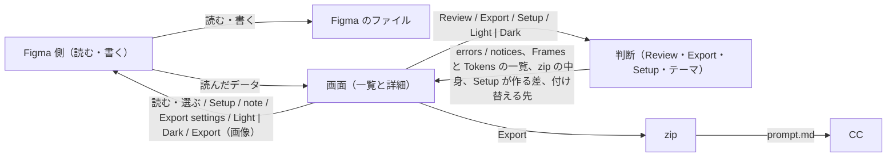

# Telldes design

## Goals

- Figma のデザインが、Claude Code（以下 CC）がカンプと同じ見た目に組めるかたちで渡る。渡した zip から CC が作ったページのスクリーンショットが、Export の画像と色・大きさ・間隔・文字・並びで一致する（Dark support ON なら Light と Dark の両方）
- 渡す前に、直さないと出力が壊れるものと、渡らないものが分かる。zip を開かず、CC が作ってからでもなく、プラグインの画面で分かる

## Non-goals

- 有料の機能に頼らない: デザイナーは Figma の無償版で使う。組織内だけに配るプラグインは有料なので、Figma Community に公開する
- チームのプロジェクト向けに作らない: 渡さないものは別の Figma のページに置くので、ページ数に上限の無い Drafts が前提
- LLM を持たない: 質問をその場で作る代わりに、決めることを前もって洗い出し、Export settings の欄にする
- Figma の注釈を note に使わない: 無償版で使えるか確かでなく、プラグインで受ければプランに依らない
- Auto Layout・レイヤー名を強制しない: ファイルにあるまま渡せば出力は壊れない。デザイナーに新しい作法を覚えさせない

## Approach

- ファイルにある事実を書き出し、推測しない: ベストプラクティスどおりのファイル（Auto Layout、変数、スタイル、コンポーネント）にはコードに要る情報がそろっている。推測は外れても誰も気づかず、出力が不正確なら CC のコードもそのまま不正確になる。Figma のデータに無いことはデザイナーから受け、それでも無いものは「無い」と書く。CSS で同じに描けないもの（特殊なグラデーション、破線など）は近い見た目を CC に作らせず、Figma に描かせた画像で渡す
- 出力の形は、同じ種類は同じ形、同じ事実は1か所、落としたものは落としたと書く、指定されていないことは出さない: 形が揃えば CC の読み間違いが減り、書いていないことを CC が補わずに済む。落としたと書けば、CC が無いものを補わず、デザイナーは CC が作ってからでなく渡す前に気づける。同名のレイヤーを許す代わり、画像・アセットのファイル名はレイヤーの id で区別する
- Web ページの組は Figma の Section で表す: 幅違いのフレームが同じ Web ページだという情報は Figma のデータに無い。Section は公式の仕組みなので、Telldes だけの操作を覚えさせずに済み、組がキャンバスに見える。フレーム名から推し量ると打ち間違いに気づけず、プラグインで選ばせると組がファイルに見えない。読み方は「Section 直下のフレームだけ」の1文にして約束を最小にする。代償として、渡すフレームを置く Figma のページでは Section をキャンバスの整理には使えない
- 幅の切り替えとコンテンツ幅はデザイナーが宣言し、一番狭いフレームだけ空にする: 1440px のフレームの左右の余白がただの余白かコンテンツ幅を作るものかは、データからは決められない。一番狭いフレームがどこから使われるかは決めることが無く、どれが一番狭いかはフレームの幅（描かれた事実）から分かる
- デザインの判断はデザイナーに、実装の判断は CC の利用者に聞く: デザイナーは Figma を開いている今が一番答えやすく、zip を受け取る人がデザイナーとは限らない。CC が値として使うものは決まった値の欄で受け、文章で受けるものは、すべての Web ページに効くことを Rules for every page に、レイヤーごとのことを note に分ける。自由に書かせると書き方がぶれて機械的に読めない。note を Figma のプロパティパネルからも開けるのは、レイヤーを見ながら書け、一覧で探し直さなくてよいから
- 判断は Figma に触らない部分に集め、Review と Export は一度読んだ同じデータから作る: Figma なしで動かせ、テストで確かめられるのはこの部分だけ。別々に読むと Review したものと渡したものがずれる。画像だけは Export のときに Figma に描かせる。Review が見る範囲も Export が書き出す範囲と同じにし、渡さないものを直さないと渡せない状態を作らない
- Review は出力が壊れるときだけ止める: error は、渡しても CC が正しく作れないものだけ。Dark に付け替わらない色は Dark の画像が Light のまま渡り、Web ページ名の重複は zip のフォルダがぶつかる。指定し忘れと機械的に分かるものは止めずに知らせ、同じ原因は1行にまとめる。トークンと同じ値（色や数値）なのにつないでいないものは Dark support に依らず知らせ、ON のときは色だけが error に置き換わって notice と重ならない。数値は値だけでなく使う場所（Scope）でも照らす。推奨一式では spacing/sm と radius/md のように同じ値が多く、値だけでは持ち主のトークンが決まらない。ライトだけのファイルでどのトークンとも違う値は報告しない。値は `spec.json` に載って CC は正しく作れ、並べると LP 1枚で数十〜数百行になって本当に落としたものが埋もれる。自動で走らせるのは、error の件数を常に見せるには開いた直後から値が要るから
- ダークはフレームを複製せず、変数を付け替える: 複製すると同じ Web ページが別の Web ページとして渡り、Light の変更が Dark に伝わらない。無償版では1つのコレクションに複数のモードを作れないので、Dark を別のコレクションにして Light と同じ名前の変数を置き、Figma のページ全体のつながりを付け替える。Light にも Base にもつないでいない色と、同名が Dark に無い色が error なのは、Dark に付け替わらないから（Base はテーマで変わらない値なので付け替えなくてよい）。既定は Dark support OFF。ON を既定にすると、ダーク対応しないファイルにも「変数を使え」と促すことになる。今のテーマはプラグインの印としてファイルに保存する。つながりから推定すると、Dark のまま残ったことが分からない。代償として、ファイルが「今どちらのテーマか」という状態を持ち、キャンバスで Light と Dark を並べて比べられないので、比べるのは Export した画像で行う
- トークンにするのは CSS の値になるものだけ: Color・Number と、使える場所（Scope）に Font family か Font style を含む String、Text Style、Effect Style。Setup が作る font/* にはこの Scope を付ける。文字の中身に使う String（Scope が Text content）と Boolean は値であって CSS の変数にならない。Color Style を出さないのは、色を変数と Color Style の2つで持つと同じ事実が2か所になり、Light / Dark の付け替えは変数でしかできないから
- Setup は足りないものだけ作る: 無償版ではファイルをまたいで変数を共有できず、手で作らせると使える場所の絞り込み（Scope）や CSS の変数名（Code syntax）を漏らす。差だけを作れば何度押しても増えず、手で作ったものを上書きしない。Export と付け替えが頼るのは名前の約束（Light / Dark / Base、同名の変数）であって Setup ではないので、Setup を使わずに作ったファイルもそのまま読めて正しく出る
- 画面はオブジェクト指向で組む: 並べるのはデザイナーが気にするもの（トークン・Web ページ・フレーム・レイヤー）であり、機能ではない。機能ごとに分けると、同じレイヤーの error と note が別々の場所に入り、直す場所と知らせる場所がずれる。持ち主はデザイナーが下す1つの判断の対象で決める（同じ色が30か所なら判断は「この色をどうするか」の1つで、トークンの1行。Dark support ON で Dark コレクションが無いときは、色ごとの「同名が Dark に無い」を出さず、判断は「Setup を押すか Dark support を OFF にするか」の1つなのでファイルの error 1つ）。どのトークンとも違う値は、Tokens の一覧に値の行として並べ、その error・notice を持たせる。判断の対象は、まだトークンの無い値そのものだから。使っている所を押しても詳細は持ち主のまま動かさず、30か所を順に直すあいだ判断の対象を見失わない。Export settings も持ち主に付け、1つの事実を1か所に置く（題名は幅が変わっても同じなので Web ページ）
- 画面の言葉は英語: Community で配るプラグインは利用者の言語が分からない
- 渡さないものは別の Figma のページに置いてもらう: どのフレームを渡すかを示す印は Figma に無いので、ページ直下と Section 直下の表示中のフレームをすべて渡す
- テストは実物から取った入力で、正解は約束に照らして作る: 手で作った入力は Figma が実際に返す形と食い違いうる。正解を今の出力から写すと、崩れていても通る。結果は丸ごと比べる。一部だけ見るテストは、見ていないところが崩れても通る。Figma でしか分からないこと（読み取った値、画像の書き出し、付け替えの書き込み、画面）は実機で確かめる
- Assumes: 無償版でコレクションの数に制限が無い。Section 直下のフレームを API で読める。ページ全体の変数のつながりを付け替えられる

## Structure

- Figma のファイル: デザインと変数・スタイル、Export settings と note、今のテーマ。すべてファイルに保存される
- Figma 側（読む・書く）: 読んだものを JSON にできるデータにまとめ、言われたとおりに書き込み、Export のときに画像を描く。判断を持たない
- 判断（Review・Export・Setup・テーマ）: 読んだデータと設定だけを受け、Figma の API を呼ばない。テストの対象はここだけ
- 画面（一覧と詳細）: 表示と操作と、Figma 側との往復
